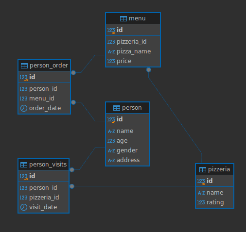

# SQL_Bootcamp_s21
SQL Projects from School 21 (Sber)

## General Information
|------------------------------------------------------------------------------------------------------------------------------------------------------------|
These are SQL educational projects from School 21 (Sber). These projects cover all key aspets of relational DB managment.

Each day directory contains of:
- exercise directories with SQL queries
- README file with formulation of the exercises

There is also a model directory with model.sql, constructing general SQL model for exercises where it is needed
Model looks like:

## Exercise information
|------------------------------------------------------------------------------------------------------------------------------------------------------------|
Day 0: general information about relational model, selecting, basic SQL constructions
Day 1: set operations, simple joins
Day 2: diving into JOINs constructions
Day 3: DML language basics
Day 4: making virtual view and physical snapshot of data 
Day 5: handling with database indexes 
Day 6: adding new features into data model 
Day 7: using specific OLAP constructions
Team 00: implementing a quick solution on SQL to achieve results of Traveling Salesman Problem

